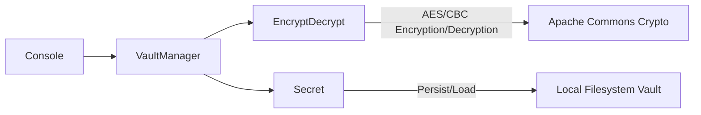

# TimeSafe for Secrets

A **TimeSafe** application that encrypts secrets and locks them until a specified future date. The system uses AES encryption (via [Apache Commons Crypto](https://commons.apache.org/proper/commons-crypto/)) to protect data, and Java’s serialization to store encrypted objects in a local `vault` directory on disk.

This repository contains a simple console-based interface to:
- **Add new secrets** (encrypted immediately).
- **List existing secrets**.
- **Manage secrets** (view metadata, decrypt if unlocked, extend lock time, or delete).

> **Note**: This code is intended for demonstration purposes and is not production-hardened. Storing hard-coded keys and IVs in source code is **not** secure for real-world applications.

---

## Table of Contents

1. [Architecture Overview](#architecture-overview)
2. [Key Components](#key-components)
    - [EncryptDecrypt](#encryptdecrypt)
    - [Secret](#secret)
    - [VaultManager](#vaultmanager)
    - [Main](#main)
3. [Application Flow](#application-flow)
4. [Usage](#usage)
    - [Prerequisites](#prerequisites)
    - [Running the Application](#running-the-application)
5. [Technical Details](#technical-details)
6. [Security Considerations](#security-considerations)
7. [License](#license)

---

## Architecture Overview




## Key Components

### EncryptDecrypt
- **Purpose**: Central encryption/decryption logic using [Apache Commons Crypto](https://commons.apache.org/proper/commons-crypto/).
- **Key Operations**:
   - `encrypt(String input)`: Encrypts plain text and returns a byte array.
   - `decrypt(byte[] encrypted)`: Decrypts a byte array and returns plain text.
- **Implementation Details**:
   - Uses a hard-coded AES key and IV (`"1234567890123456"`). **Not secure** for production.
   - Utilizes `CryptoOutputStream` and `CryptoInputStream` for encryption/decryption.

### Secret
- **Purpose**: Holds the encrypted data, its associated metadata (e.g., `name`, `id`), and the `decryptionDate`.
- **Storage**:
   - Serialized to the local filesystem under `vault/<UUID>`.
   - `availableForDecryption()` checks if the current time is after the `decryptionDate`.
- **Construction**:
   - Created in `VaultManager` when adding a new secret.
   - Loaded from a file constructor `Secret(String filename)`.

### VaultManager
- **Purpose**: Primary interface for all secret-related operations.
- **Functions**:
   - `putSecret(int daysUntilDecryption, String secret, String name)`: Encrypts and stores a new secret.
   - `updateSecret(Secret secret, int additionalDays)`: Extends the lock time of an existing secret.
   - `getSecrets()`: Returns all secrets found in the `vault/` directory.
   - `decrypt(Secret secret)`: Decrypts the data for a given `Secret`.
   - `delete(Secret secret)`: Removes a secret file from the `vault` directory.

### Main
- **Purpose**: Console UI for interacting with the VaultManager.
- **Features**:
   - Menu-driven interface:
      - **Add a new secret**: Prompt for secret text, name, and lock duration.
      - **List secrets**: Enumerate stored secrets, show lock status, manage secrets (decrypt, extend lock, delete).

---

## Application Flow

```mermaid
sequenceDiagram
    participant User
    participant Main
    participant VaultManager
    participant EncryptDecrypt
    participant Secret
    participant Filesystem

    User->>Main: Select "Add new secret"
    Main->>VaultManager: putSecret(days, secretText, name)
    VaultManager->>EncryptDecrypt: encrypt(secretText)
    EncryptDecrypt-->>VaultManager: returns encrypted bytes
    VaultManager->>Secret: Create new Secret(decryptionDate, encryptedData, name)
    Secret->>Filesystem: Serialize and store in vault
    Note right of Filesystem: Secret is now locked until<br> the specified decryption date
   ```
## Usage

### Prerequisites
- **Java 8+** (the code uses modern Java APIs like `Instant` and `try-with-resources`).
- [Apache Commons Crypto](https://commons.apache.org/proper/commons-crypto/), [Apache Commons IO](https://commons.apache.org/proper/commons-io/), and [Apache Commons Lang3](https://commons.apache.org/proper/commons-lang/) libraries in your classpath.  
  You can include them via Maven/Gradle or manually add the JARs.

### Running the Application
1. **Clone or Copy** this repository.
2. **Create a `vault` directory** in the project root (where serialized secrets will be stored).
3. Compile the source (using your preferred build method, e.g., `javac` or Maven).
4. **Run** the `org.louis.Main` class:
   ```bash
   java org.louis.Main
   ```
5.	Interact with the console menu to add/list/manage secrets.

Example Output:

```aiignore
1) Add a new secret to the vault
2) List secrets in the vault
> 1

What should we call this secret?
> MySecret

Enter the secret:
> The password for my safe is 'Swordfish'.

How many days should we lock this secret for?
> 2

Done
```

## Technical Details

- **Encryption**:
   - **Algorithm/Mode**: `AES/CBC/PKCS5Padding`
   - **Key and IV**: Hard-coded 16-byte strings (`"1234567890123456"`).
- **Secret Storage**:
   - Each secret is serialized to disk using Java’s `ObjectOutputStream`.
   - Files are named after the `Secret` UUID and placed in the `vault` folder.
- **Time-Based Locking**:
   - `Instant decryptionDate`: If `Instant.now()` is before `decryptionDate`, the secret remains locked.
   - If locked, any attempt to decrypt will be denied with a message showing how many hours remain.

---

## Security Considerations

1. **Hard-Coded Key and IV**:  
   For demonstration only. In production, never store encryption keys in code.
2. **Local File-Based Storage**:  
   Secrets are stored on disk in a serialized form. If the attacker gains file system access, they could read or modify the files.
3. **Serialization Risks**:  
   Deserialization of untrusted data can be dangerous. Use safe practices or a format like JSON with robust checks.
4. **No Integrity Checks**:  
   The system does not verify if files were tampered with. A malicious actor could alter or delete serialized files.

---

## License

This project is provided as-is, primarily for learning and demonstration. You may adapt or extend as needed for personal or educational use. If you intend to use it in a production environment, you must apply **robust security practices**, such as using secure key management, validated cryptographic libraries, and database/secure file storage with access controls.
project is provided as-is, primarily for learning and demonstration. You may adapt or extend as needed for personal or educational use. If you intend to use it in a production environment, you must apply robust security practices, such as using secure key management, validated cryptographic libraries, and database/secure file storage with access controls.