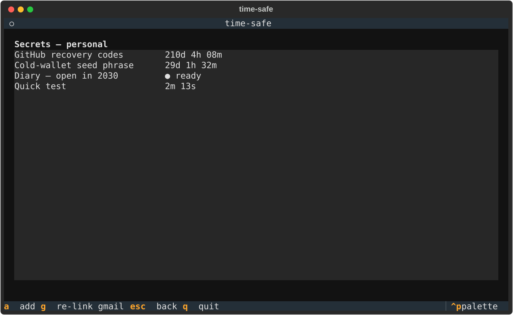
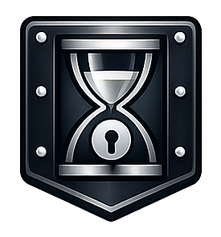
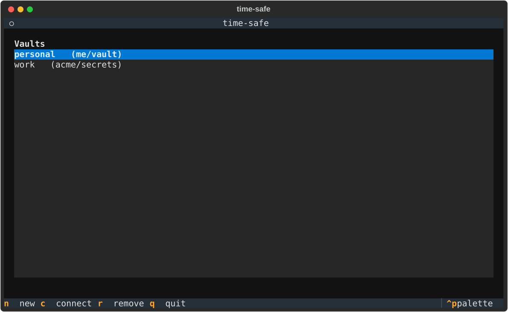
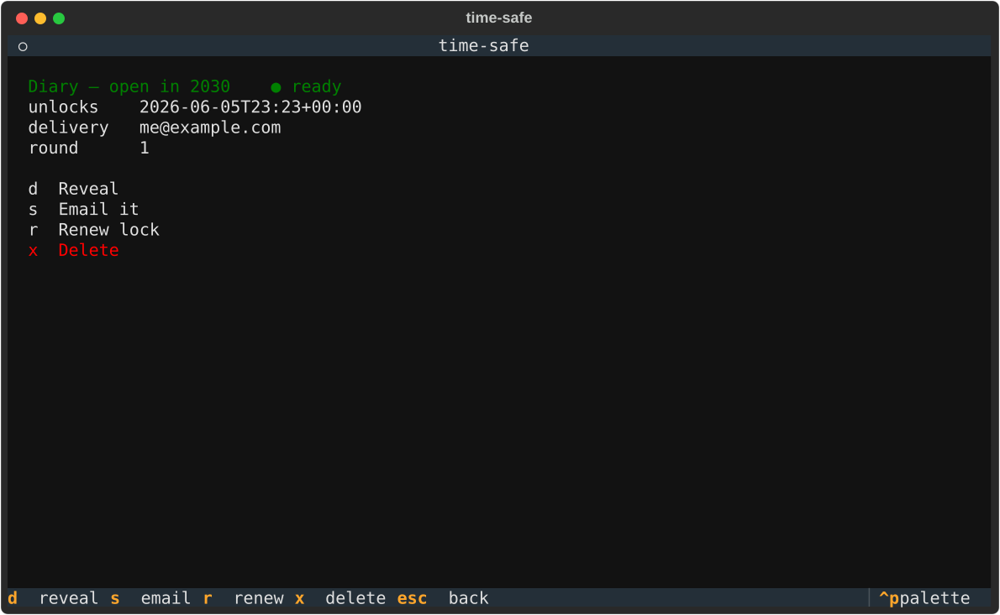
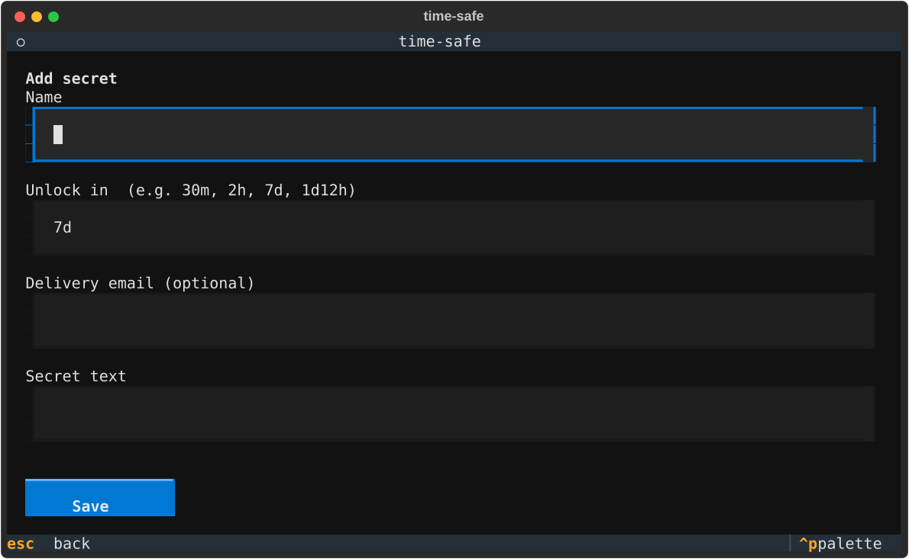
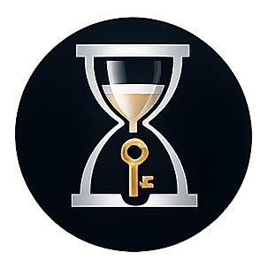

<p align="center">
  
</p>

<p align="center">
  <b>Lock a secret until a future moment — so that <i>nobody</i>, not even you, can read it early.</b>
</p>

<p align="center">
  
  
  
  <a href="https://github.com/louisalexander/time-safe/actions/workflows/ci.yml"></a>
  <a href="https://louisalexander.github.io/time-safe/"></a>
</p>

<p align="center"></p>

**time-safe** timelock-encrypts your secrets, stores only the ciphertext in a GitHub repo, and lets you reveal them only **after a date you choose**. The lock is enforced by cryptography — the [drand](https://drand.love) distributed randomness beacon via [tlock](https://github.com/drand/tlock) — not by an honour system.

> **No decryption key is ever stored, anywhere.** Until the unlock time arrives, the key literally does not exist — so neither you, nor GitHub, nor anyone who copies the repo can decrypt early.

A keyboard-driven terminal app built with [Textual](https://textual.textualize.io/). (Python rewrite of the original Java version.)

---

## ✨ Why it's different

<table>
<tr>
<td width="120" align="center"></td>
<td>

- **🔒 Cryptographic, not honour-system.** Each secret is encrypted to a future drand round; the threshold-BLS signature that decrypts it isn't produced by the beacon network until that wall-clock time.
- **🗝️ No keys, anywhere.** The repo holds only ciphertext (`vault/secrets/<id>.tle`). Nothing to find, leak, or be tempted by.
- **👁️ Reveal locally.** Once unlocked, the app fetches the ciphertext + the now-public drand signature and decrypts in memory — the plaintext never touches disk.
- **📧 Optional email delivery.** A per-secret GitHub Actions workflow decrypts at the unlock time and emails you the plaintext via Gmail.
- **🧰 Almost nothing local.** Only a list of vaults lives on disk; GitHub tokens go in your OS keychain.

</td>
</tr>
</table>

## 📸 Screens

| Vaults | Secret (ready) | Add secret |
|:---:|:---:|:---:|
|  |  |  |

## 🚀 Quick start

**Requirements:** Python 3.12+ and [uv](https://docs.astral.sh/uv/); the drand **`tle`** binary; a **private** GitHub repo + a token with `contents` + `secrets` + `workflows` write access.

```bash
# get the tlock CLI (pick your OS/arch from the releases page)
mkdir -p .tools
curl -sL https://github.com/drand/tlock/releases/download/v1.2.0/tlock_1.2.0_darwin_arm64.tar.gz | tar -xz -C .tools tle

# run it
uv sync
uv run timesafe
```

In the app:

| Key | Does |
|---|---|
| `n` / `c` | initialize a new vault / connect to an existing one |
| `a` | add a secret — name, a duration (`30m`, `2h`, `7d`, `1d12h`), optional delivery email, text |
| `d` | **reveal** a ready secret locally |
| `s` | **email** a ready secret's plaintext to its address |
| `r` | **renew** — re-lock a ready secret for a new duration |
| `x` | delete · `g` re-link Gmail · `q` quit |

## 🤖 Scripting it (non-interactive CLI)

Alongside the TUI there's a CLI for other programs to drive — no TTY, no prompts, works from cron or a
systemd unit. Bare `timesafe` still opens the TUI.

```bash
uv tool install timesafe        # wheels bundle the `tle` binary — nothing else to fetch

# ...or, on a host with no usable modern Python (no pip, no venv, no container):
curl -sL https://github.com/louisalexander/time-safe/releases/latest/download/timesafe-linux-amd64 \
  -o ~/.local/bin/timesafe && chmod +x ~/.local/bin/timesafe
```

Point it at a vault with two environment variables, then:

```bash
export TIMESAFE_VAULT=me/my-vault TIMESAFE_GITHUB_TOKEN=ghp_...

# Generate a secret and lock it — never on screen, never in argv, never in shell history.
openssl rand -base64 32 | timesafe add --name break-glass --duration 10d --secret-stdin
# {"id":"3f2a91c4-...","name":"break-glass","unlock_at":"2026-08-17T12:00:00+00:00",
#  "round":19273645,"vault_path":"vault/secrets/3f2a91c4-....tle","pushed":true}

timesafe status --id "$ID" --json      # {"ready":false,"seconds_remaining":863995,...}
timesafe reveal --id "$ID"             # plaintext only, no trailing newline; exit 3 if not yet
timesafe list --json
timesafe init --vault me/new-vault --name seedbox --create   # idempotent; always private
```

| Exit | Meaning |
|---|---|
| `0` | ok |
| `2` | usage error |
| `3` | **not yet unlockable** — distinct from a failure, so callers can poll |
| `4` | vault / network error |
| `5` | no such secret |

Errors are JSON on stderr with a stable `code` field. The same logic is importable — `timesafe.api.add
/ status / reveal / list_secrets / init` — if you'd rather skip the subprocess.

> **Persist the `id` that `add` returns.** It's the vault's authoritative key. Secret **names are not
> unique** and nothing enforces it, so never construct an id from a name; `--name` lookup exists as a
> convenience and fails loudly if it's ambiguous.

📖 Full reference, including cron/systemd examples: **[CLI & automation](https://louisalexander.github.io/time-safe/cli/)**

## 📧 Gmail delivery (one-time, optional)

Email uses **your own** Google Cloud OAuth client:

1. [Google Cloud Console](https://console.cloud.google.com) → enable the **Gmail API**.
2. OAuth **consent screen**: External, scope `https://www.googleapis.com/auth/gmail.send`; add your address as a **Test user** or **Publish** (publishing avoids the 7-day refresh-token expiry).
3. **Credentials → OAuth client ID → "Desktop app"** (not "TVs and Limited Input devices" — Google's device flow rejects `gmail.send`; time-safe uses the loopback flow). Note the client id + secret.
4. In time-safe press **`g`**, enter the Gmail address + client id/secret → **Link** → approve in the browser.

The refresh token + client secret are stored **only** as GitHub Actions secrets in the vault repo — never locally.

## 🛡️ Security model

- Confidentiality **before** the unlock time is cryptographic (drand threshold) — the repo can be seen without leaking anything early.
- **After** unlock, anyone with repo read access can decrypt — so keep the vault repo **private**.
- Trust assumptions: the drand threshold isn't compromised before the unlock time, and drand mainnet stays live (a robust multi-org network; the chain hash is pinned per secret).
- A real time-lock means the unlock time is **immutable** — there's no "extend." To re-time a secret, reveal it after unlock and add it again (or **Renew** a ready one).

📖 Full docs: **<https://louisalexander.github.io/time-safe/>** — [getting started](docs/getting-started.md) · [architecture](docs/architecture.md) · [usage](docs/usage.md) · [security](docs/security.md)

## 🧑‍💻 Development

```bash
uv run pytest                                                  # unit + Textual Pilot tests
TIMESAFE_LIVE=1 uv run pytest tests/test_tle.py -k roundtrip   # live drand roundtrip
uv run python scripts/make_screenshots.py                      # regenerate docs/screenshots
```

<p align="center"><br><sub><b>Encrypt Today. Unlock Tomorrow.</b></sub></p>
