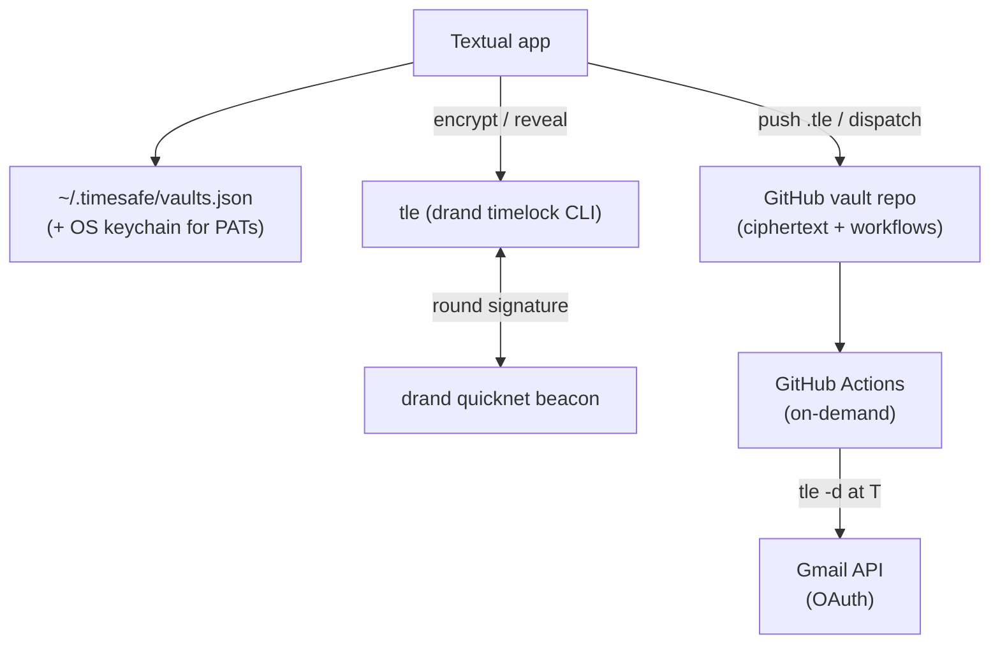

# Architecture

## Overview

time-safe stores only **timelock ciphertext** in a GitHub repo — there is no key anywhere. Decryption requires the [drand](https://drand.love) beacon's signature for a future round, which the network only publishes once that time arrives.



## Encryption (add)

1. The app fetches drand `quicknet` info and maps the unlock time → a round number.
2. `tle` timelock-encrypts the plaintext to that round.
3. The ciphertext is pushed to `vault/secrets/<id>.tle`; metadata (`id`, `name`, `unlock_at`, `drand_round`, `drand_chain`, `created_at`, optional `delivery_email`) to `<id>.meta`; and a per-secret `workflow_dispatch` workflow to `.github/workflows/unlock-<id>.yml`.

**No key file is created or stored.** The unlock time is encoded in the ciphertext, not in any retrievable secret.

## Reveal (local)

Once `now ≥ unlock_at`, the app fetches `<id>.tle` and runs `tle -d`, which pulls the now-public round signature from drand and decrypts **in memory**. Before the round, `tle` reports "too early" and the app keeps counting down. Plaintext never touches disk.

## Email delivery (optional)

"Email it" dispatches the per-secret workflow. The job installs `tle`, runs `vault/scripts/send_secret.py` which:

1. `tle -d` the ciphertext (this *is* the server-side time gate — fails before T),
2. exchanges the vault's Gmail **OAuth refresh token** (a repo Actions secret) for an access token,
3. sends the plaintext via the Gmail API to the secret's delivery address.

On a revoked/expired token it exits non-zero and opens a "Gmail re-authorization required" issue.

## Renew

A **ready** secret can be re-locked: the app decrypts it (possible now), encrypts the plaintext to a new future round, and overwrites the ciphertext/metadata/workflow. A still-locked secret cannot be renewed — it can't be read to re-encrypt.

## Module layout

| Module | Responsibility |
|---|---|
| `config/registry.py` | `~/.timesafe/vaults.json` — the only local state (vault name + repo) |
| `config/credentials.py` | GitHub PATs in the OS keychain via `keyring` |
| `timelock/drand.py` | fetch beacon info; map a date → round |
| `timelock/tle.py` | `encrypt` / `decrypt` via the `tle` binary; `NotYetUnlocked` |
| `vault/secret.py` | the `Secret` model + `.meta` JSON |
| `vault/workflow.py` | the unlock-workflow YAML + the `send_secret.py` delivery script |
| `vault/vault.py` | orchestration: init, put, list, reveal, renew, delete, dispatch, relink |
| `github/client.py` | thin httpx GitHub REST client |
| `github/secrets_api.py` | PyNaCl sealed-box for writing Actions secrets |
| `oauth/loopback_flow.py` | Gmail OAuth (loopback/installed-app, PKCE) |
| `screens/` | Textual screens (picker, init/connect, gmail link, list, detail, add, reveal, renew) |

## Tests

```bash
uv run pytest
```

Pure logic (crypto round math, secret model, workflow strings, OAuth helpers, registry) is unit-tested; the GitHub client is tested against a mocked HTTP transport (`respx`); screens are exercised with Textual's `Pilot`. The live drand roundtrip is opt-in (`TIMESAFE_LIVE=1`).
