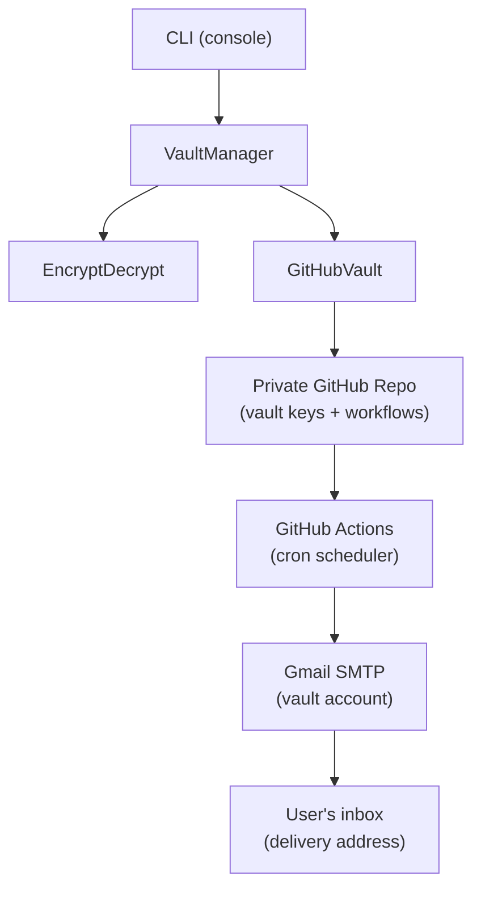

# Architecture

## Overview

TimeSafe separates the encrypted secret (stored locally) from the decryption key (stored remotely, delivered only on a future date). This physical separation is the foundation of the time-lock guarantee.



When a secret is locked:

1. The CLI encrypts the secret locally with a fresh AES key.
2. `GitHubVault` pushes the AES key (base64-encoded) to the private vault repo.
3. `GitHubVault` pushes a GitHub Actions workflow YAML to the vault repo. The workflow is scheduled to run on the unlock date.
4. On the unlock date, GitHub Actions runs the workflow, which emails the key to the delivery address.
5. The user pastes the key into the CLI to decrypt the locally stored ciphertext.

The key never touches the local filesystem.

---

## Encryption

Each secret gets its own key and IV generated fresh at lock time:

- **Key**: 256-bit random, generated with `java.security.SecureRandom`
- **IV**: 128-bit random, generated with `java.security.SecureRandom`
- **Algorithm**: AES/CBC/PKCS5Padding via Apache Commons Crypto

The encrypted ciphertext is written to `<uuid>.enc` in the local working directory. The IV is stored in the secret's metadata file (`<uuid>.meta`) as a base64 string — the IV is not secret, but it must be the same at decryption time.

The AES key is **never written to disk locally**. It is immediately base64-encoded and pushed to the vault repo, then discarded from memory when the JVM process ends.

---

## Key storage

The AES key lives at `vault/keys/<uuid>.key` in the private GitHub vault repo. It is stored as a plain base64 string — the file itself is the sole copy of the key.

Access to this file requires:

1. A GitHub account with access to the vault repo, OR
2. A GitHub PAT with `repo` scope for that repo

The vault repo access is itself protected by the vault Gmail account (GitHub login recovery). The vault Gmail password is locked in TimeSafe. This creates the recursive lock: to break the lock early, you would need the vault Gmail password, which is itself locked.

---

## Time-lock mechanism

When a secret is created, `VaultManager` generates a GitHub Actions workflow YAML and pushes it to `.github/workflows/unlock-<name>.yml` in the vault repo.

The workflow schedule is derived from the unlock date:

```yaml
on:
  schedule:
    - cron: '0 9 <day> <month> *'
  workflow_dispatch:
```

The `workflow_dispatch` trigger allows manual re-run if the scheduled run fails (e.g. GitHub outage), but only from within the vault repo — which requires vault Gmail access.

The workflow runs a Python script (`vault/scripts/send_key.py`) that:

1. Reads `vault/keys/<uuid>.key` from the repo filesystem (it is checked out by the workflow).
2. Connects to Gmail SMTP using credentials stored as GitHub Actions secrets in the vault repo.
3. Sends an email containing the base64 key to the delivery address.

---

## Decryption flow

1. On the unlock date, the scheduled GitHub Actions workflow runs and emails the base64 AES key to the delivery address.
2. The user opens the email and copies the key.
3. The user runs the TimeSafe CLI, selects the secret (option `2`), then chooses `Decrypt` (option `2` in the submenu).
4. The CLI prompts for the base64 key.
5. The CLI fetches the `.meta` file from GitHub (via the GitHub Contents API) to read the IV.
6. `EncryptDecrypt.decrypt()` is called with the decoded key, the decoded IV, and the ciphertext from the local `.enc` file.
7. The plaintext secret is printed to the console.

---

## Code structure

| Class | Responsibility |
|-------|---------------|
| `Config` | Loads `~/.timesafe/config.json` — GitHub PAT, vault repo, Gmail credentials, delivery address |
| `VaultManager` | Orchestrates put / get / delete / extend operations; calls `EncryptDecrypt` and `GitHubVault` |
| `GitHubVault` | All GitHub API calls (push file, fetch file, delete file) via `java.net.http.HttpClient` and the GitHub Contents API |
| `EncryptDecrypt` | Static `encrypt(key, iv, plaintext)` and `decrypt(key, iv, ciphertext)` methods using Apache Commons Crypto |
| `Secret` | POJO: `id` (UUID), `name`, `decryptionDateIso` (ISO-8601 string), `ivBase64`. Serialized to/from JSON for the `.meta` file. |

`Secret.availableForDecryption()` returns `true` when `Instant.now().isAfter(decryptionDate)`. The time-lock is enforced at read time in the CLI — the `.enc` file is always present on disk; only the key is gated.

---

## Build & quality gates

The Gradle wrapper (`./gradlew`) handles everything — no local Gradle install required.

```bash
./gradlew check
```

The `check` task runs in order:

1. `compileJava` — Java 21 source compilation
2. `test` — 17 JUnit 4 unit tests
3. `spotlessCheck` — Google Java Format 1.17 enforced via Spotless
4. `spotbugsMain` — FindSecBugs static analysis

All four must pass for a green build. `spotlessApply` auto-formats sources to fix `spotlessCheck` failures.
