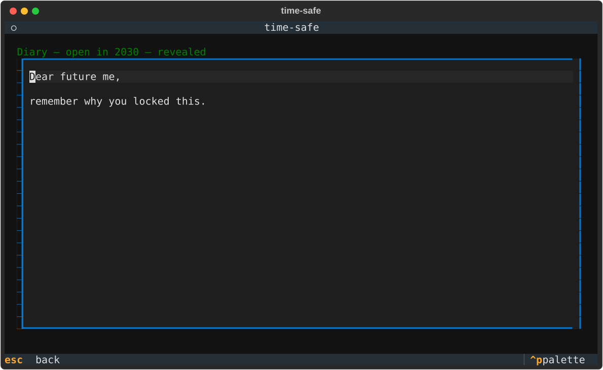

# Usage

Run with `uv run timesafe`. Everything is keyboard-driven; the footer shows the keys for the current screen.

## Vaults (home)


| Key | Action |
|---|---|
| `↵` | open the highlighted vault |
| `n` | initialize a **new** vault (name, repo, token) → then optionally link Gmail |
| `c` | **connect** to an already-initialized vault |
| `r` | remove the highlighted vault from your local list (the GitHub repo is untouched) |
| `q` | quit |

## Secrets list


Each row shows a live countdown, or **● ready** (green) once unlocked.

| Key | Action |
|---|---|
| `↵` | open the highlighted secret |
| `a` | add a secret |
| `g` | re-link Gmail for this vault (rotate the sending credential) |
| `esc` | back to the vault list |

## Secret detail


Actions appear only when a secret is **ready**:

| Key | Action | When |
|---|---|---|
| `d` | **Reveal** — decrypt locally and display the plaintext | ready |
| `s` | **Email it** — trigger the workflow to decrypt at T and email the plaintext | ready, and a delivery email is set |
| `r` | **Renew lock** — re-lock for a new duration (decrypts now, re-encrypts to a new round) | ready |
| `x` | **Delete** | always |
| `esc` | back | always |

There is no "extend" for a **locked** secret — a real time-lock means the unlock time is immutable. To re-time a secret you must wait until it's ready, then **Renew**.

## Add secret


- **Unlock in** accepts `30m`, `2h`, `7d`, `1d12h`, `90s`, or a bare number (days).
- **Delivery email** is optional and only used by "Email it".
- On save, the plaintext is timelock-encrypted and pushed as `vault/secrets/<id>.tle` (+ metadata + a `workflow_dispatch` unlock workflow). No key is stored.

## Reveal



Reveal happens entirely on your machine: the app fetches the ciphertext and the now-public drand signature for the secret's round and decrypts in memory. The plaintext is shown read-only and discarded when you leave the screen.

## Development

```bash
uv run pytest                                                  # unit + Textual Pilot tests
TIMESAFE_LIVE=1 uv run pytest tests/test_tle.py -k roundtrip   # live drand encrypt→decrypt roundtrip
uv run python scripts/make_screenshots.py                      # regenerate docs/screenshots
```
